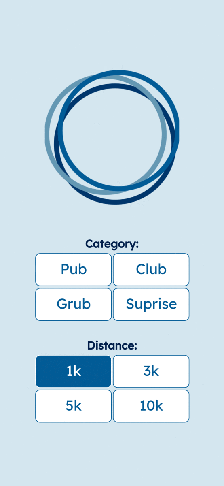
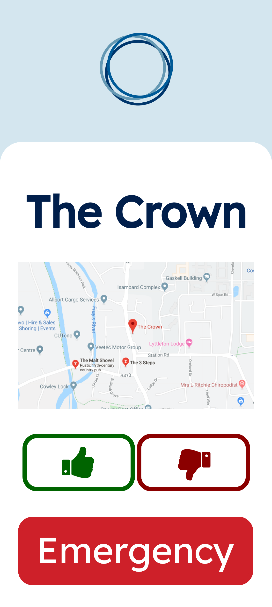
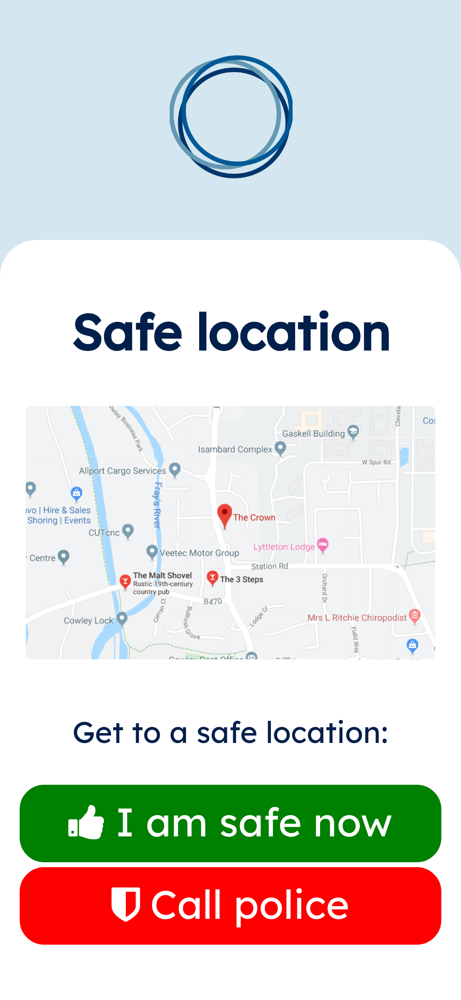

# Wheel


## About
Project wheel came second at HackBrunel and we were praised by the judges for having a well designed project that was mostly working.

The mobile app uses the location of your phone to look for anything you want near by based on catagories and the distance you have selected. Once it has a list of places the app will then choose one at random. We think this is a great app for when you are in a new city and do not know what is around or if you are a local and just extreamly indecisive.

With this project we had a emphasis on security as the even was being sponsored by McAfee. We added an emergency screen that quided you to a safe location if you needed help and also gives you a button that would allow you to call the emergancy services wherever you are in the world.

## Screenshots

### Home Screen


### Selection Screen


### Bad Review Screen


### Emergancy Screen



## How to run
1. Clone the repository https://github.com/mattdear/wheel
2. Extract the ```html/``` folder, and run the file ```index.html```.